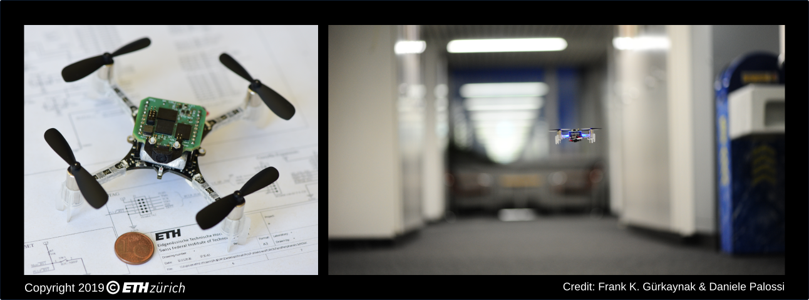

# PULP-DroNet: *Judge me by my size, do you? --Yoda, TESB*

Authors: *Daniele Palossi* <dpalossi@iis.ee.ethz.ch>
        *Vlad Niculescu* <vladn@iis.ee.ethz.ch>
        *Lorenzo Lamberti* <lorenzo.lamberti@unibo.it>
Copyright (C) 2021 ***ETH Zürich, University of Bologna***. All rights reserved.

### **Videos** 
[PULP Platform Youtube](https://www.youtube.com/c/PULPPlatform) channel (subscribe it!)
- **PULP-Dronet-V1**: [Video1](https://youtu.be/57Vy5cSvnaA) [Video2](https://youtu.be/JKY03NV3C2s).
- **PULP-Dronet-V2**: [Video1](https://youtu.be/41IwjAXmFQ0) [Video2](https://youtu.be/Cd9GyTl6tHI).

### **Citing**

If you use **PULP-DroNet** in an academic or industrial context, please cite the following publications:

Publications: 
* *A 64mW DNN-based Visual Navigation Engine for Autonomous Nano-Drones* [arXiv preprint](https://arxiv.org/abs/1805.01831) -- [IEEE IoT Journal](https://ieeexplore.ieee.org/document/8715489)
* *An Open Source and Open Hardware Deep Learning-powered Visual Navigation Engine for Autonomous Nano-UAVs* [arXiv preprint](https://arxiv.org/abs/1905.04166) -- [IEEE DCOSS](https://ieeexplore.ieee.org/document/8804776)
* *Automated Tuning of End-to-end Neural FlightControllers for Autonomous Nano-drones* [IEEE AICAS](https://ieeexplore.ieee.org/document/9458550)
* *Improving Autonomous Nano-Drones Performance via Automated End-to-End Optimization and Deployment of DNNs* -- [IEEE JETCAS](https://ieeexplore.ieee.org/document/9606685)

~~~~
@article{palossi2019pulpdronetIoTJ, 
  author={D. {Palossi} and A. {Loquercio} and F. {Conti} and E. {Flamand} and D. {Scaramuzza} and L. {Benini}}, 
  title={A 64mW DNN-based Visual Navigation Engine for Autonomous Nano-Drones}, 
  journal={IEEE Internet of Things Journal}, 
  doi={10.1109/JIOT.2019.2917066}, 
  ISSN={2327-4662}, 
  year={2019}
}
~~~~

~~~~
@inproceedings{palossi2019pulpdronetDCOSS,
  author={D. {Palossi} and F. {Conti} and L. {Benini}},
  booktitle={2019 15th International Conference on Distributed Computing in Sensor Systems (DCOSS)},
  title={An Open Source and Open Hardware Deep Learning-Powered Visual Navigation Engine for Autonomous Nano-UAVs},
  pages={604-611},
  keywords={autonomous navigation, nano-size UAVs, deep learning, CNN, heterogeneous computing, parallel ultra-low power, bio-inspired},
  doi={10.1109/DCOSS.2019.00111},
  ISSN={2325-2944},
  month={May},
  year={2019},
}
~~~~

~~~~
@inproceedings{niculescu2021pulpdronetAICAS,
  author={V. {Niculescu} and L. {Lamberti} and D. {Palossi} and L. {Benini}},
  booktitle={2021 IEEE International Conference on Artificial Intelligence Circuits and Systems (AICAS)},
  title={Automated Tuning of End-to-end Neural FlightControllers for Autonomous Nano-drones},
  pages={},
  keywords={autonomous navigation, nano-size UAVs, deep learning, CNN, heterogeneous computing, parallel ultra-low power, bio-inspired},
  doi={},
  ISSN={},
  month={},
  year={2021},
}
~~~~

~~~~
@ARTICLE{pulpdronetv2JETCAS,
  author={Niculescu, Vlad and Lamberti, Lorenzo and Conti, Francesco and Benini, Luca and Palossi, Daniele},
  journal={IEEE Journal on Emerging and Selected Topics in Circuits and Systems}, 
  title={Improving Autonomous Nano-drones Performance via Automated End-to-End Optimization and Deployment of DNNs}, 
  year={2021},
  volume={},
  number={},
  pages={1-1},
  doi={10.1109/JETCAS.2021.3126259}}
~~~~

## 1. Introduction
### What is PULP-Dronet ?
**PULP-DroNet** is a deep learning-powered *visual navigation engine* that enables autonomous navigation of a pocket-size quadrotor in a previously unseen environment.
Thanks to PULP-DroNet the nano-drone can explore the environment, avoiding collisions also with dynamic obstacles, in complete autonomy -- **no human operator, no ad-hoc external signals, and no remote laptop!**
This means that all the complex computations are done directly aboard the vehicle and very fast.
The visual navigation engine is composed of both a software and a hardware part.

- **Software component:**
The software part is based on the previous [DroNet](https://github.com/uzh-rpg/rpg_public_dronet) project developed by the [RPG](http://rpg.ifi.uzh.ch/) from the University of Zürich (UZH). 
DroNet is a shallow convolutional neural network (CNN) which has been used to control a standard-size quadrotor in a set of environments via remote computation.

- **Hardware components:**
The hardware soul of PULP-DroNet is an ultra-low power visual navigation module embodied by a pluggable PCB (called *shield* or *deck*) for the [Crazyflie 2.0](https://www.bitcraze.io/crazyflie-2/)/[2.1](https://www.bitcraze.io/crazyflie-2-1/) nano-drone. The shield features a Parallel Ultra-Low-Power (PULP) GAP8 System-on-Chip (SoC) from GreenWaves Technologies (GWT), an ultra-low power HiMax HBM01 camera, and off-chip Flash/DRAM memory; This pluggable PCB has evolved over time, from the [*PULP-Shield*](https://ieeexplore.ieee.org/document/8715489) , the first custom-made prototype version developed at ETH Zürich, and its commercial off-the-shelf evolution, the [*AI-deck*](https://store.bitcraze.io/products/ai-deck).

## Evolution of PULP-Dronet

###  **PULP-Dronet-V1:**
The first version of PULP-Dronet, which gave the birth to the PULP-Shield: a lightweight, modular and configurable printed circuit board (PCB) with highly optimized layout and a form factor compatible with the Crazyflie nano-sized quad-rotor. 
We developed a [general methodology](https://arxiv.org/abs/1805.01831) for deploying state-of-the-art deep learning algorithms on top of ultra-low power embedded computation nodes, like a miniaturized drone, and then we [automated the whole process](https://ieeexplore.ieee.org/document/9458550).
Our novel methodology allowed us first to deploy DroNet on the _PULP-Shield_, and then demonstrating how it enables the execution the CNN on board the CrazyFlie 2.0 within only 64-284mW and with a throughput of 6-18 frame-per-second!
Finally, we field-prove our methodology presenting a closed-loop fully working demonstration of vision-driven autonomous navigation relying only on onboard resources, and within an ultra-low power budget.
See the videos on the [PULP Platform Youtube](https://www.youtube.com/channel/UCpad_lwSfoMZkb6X7FdjU0g) channel: [video](https://youtu.be/JKY03NV3C2s).

Summary of characteristics:

- **Hardware:** [*PULP-Shield*](https://ieeexplore.ieee.org/document/8715489)

- **Deep learning framework:** Tensorflow/Keras

- **Quantization**: fixed-point 16 bits, hand crafted

- **Deployment tool**: _AutoTiler_ (early release, developed in collaboration with GreenWaves Technologies)

We release here, as open source, all our code, hardware designs, datasets, and trained networks.

###  **PULP-Dronet-V2:**

This follow-up takes advantage of a new commercial-off-the-shelf PCB design based on the PULP-Shield, now developed and distributed by Bitcraze: the AI-deck. Our work focused in automating the whole deployment process of a convolutional neural network, which required significant complexity reduction and fine-grained hand-tuning to be successfully deployed aboard a flying nano-drone.
Therefore, we introduce methodologies and software tools to streamline and automate all the deployment stages on a low-power commercial
multicore SoC, investigating both academic (NEMO + DORY) and industrial (GAPflow by GreenWaves) tool-sets. We reduced by 2× the memory footprint of PULP-DronetV1, employing a fixed-point 8 bit quantization, achieving a speedup of 1.6× in the inference time, compared to the original hand-crafted CNN, with the same prediction accuracy.
Our fully automated deployment methodology allowed us first to deploy DroNet on the AI-Deck, and then demonstrating how it enables the execution the CNN on board the CrazyFlie 2.1 within only 35-102mW and with a throughput of 9-17 frame-per-second!

Summary of characteristics:

- **Hardware:** [*AI-deck*](https://store.bitcraze.io/products/ai-deck)

- **Deep learning framework:** Pytorch

- **Quantization**: fixed-point 8 bits, fully automated (with both academic [NEMO](https://github.com/pulp-platform/nemo) and the industrial [NNTool](https://greenwaves-technologies.com/sdk-manuals/nn_quick_start_guide/))

- **Deployment**: fully automated (with both the academic [DORY](https://github.com/pulp-platform/dory) and the industrial [AutoTiler](https://greenwaves-technologies.com/sdk-manuals/nn_quick_start_guide/))

We release here, as open source, all our code, hardware designs, datasets, and trained networks.
