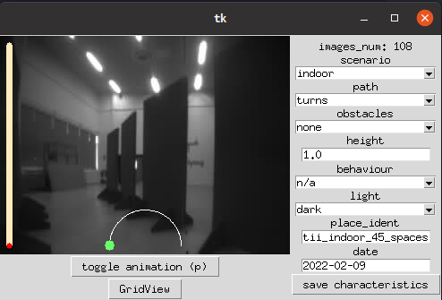
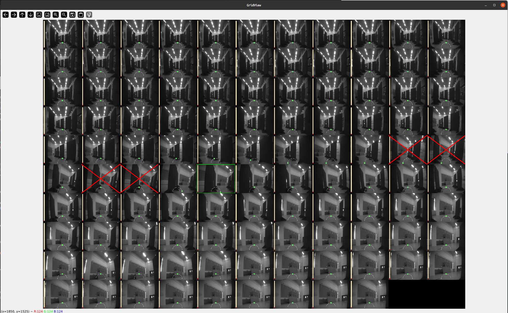

# Dataset visualizer

<p float="center">
  
  
</p>

<p align="center"> <i> Left: the dataset_visualizer. Right: the dataset visualizer "grid view".</i> </p>


This tool allows for:
* visualization of all the images of the dataset
* changing labels manually, if you spot errors
* visualize and modify the metadata of the acquisition folders
* generate videos of the acquisition sequencies, including images and labels.

## Setup

Create conda env:
```bash
conda create -n dataset_visualizer python
conda activate dataset_visualizer
```

Install dataset_visualizer local package:
```bash
cd pulp-dronet/dataset_visualizer/
pip install -e .
```

## How to use the dataset visualizer

Refer to `main.py` for the dataset visualizer. Example:

```bash
cd dataset_visualizer/
python main.py --dataset_path=../../pulp-dronet/tiny-pulp-dronet-v3/dataset/testing/lorenzo_lamberti/dataset-session1 --acquisition=acquisition1
```

Additional options:
```bash
--video : genetare a video with opencv of the acquisition folder (images + labels)
--framerate : set the framerate of the video [frames/s]
--mark_collision : mark all images in this acquisition folder as collision
--mark_no_collision : mark all images in this acquisition folder as no collision
```

**How to use the GUI:**
* Use 'a' and 'd' to switch to previous/next image.
* Use 'w' to mark collision.
* Use 's' to mark no collision.
* Use 'i' to delete an erroneous yaw rate
* Use 'l' to go left
* Use 'r' to go right
* Use 'q' to delete the image from the dataset (it won't be displayed next time the program is started)
* Use 'e' to un-delete the image

Everything is saved as soon as you change the value.


**Bonus**
If you want faster image visualization use opencv only:

```bash
cd dataset_visualizer/
python imave_visualizer.py --dataset_path=../../pulp-dronet/tiny-pulp-dronet-v3/dataset/testing/lorenzo_lamberti/dataset-session1 --acquisition=acquisition1
```