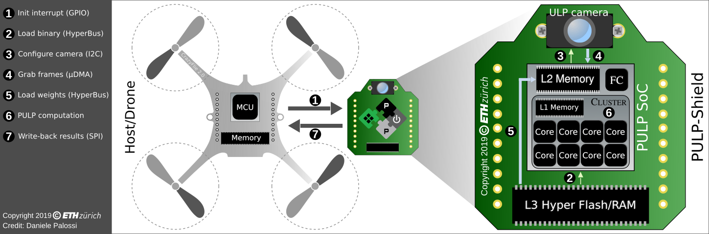
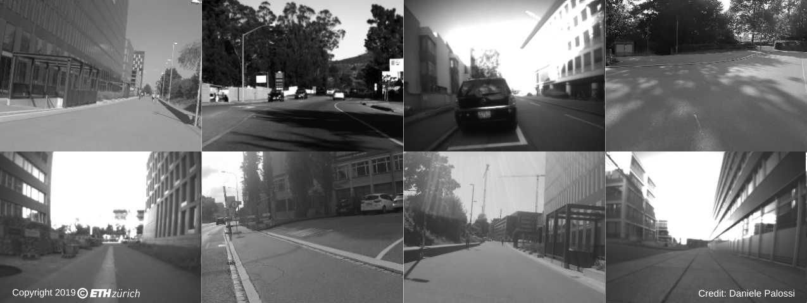

# PULP-DroNet V1

Author: *Daniele Palossi* <dpalossi@iis.ee.ethz.ch>
Copyright (C) 2019 ***ETH Zürich***. All rights reserved.


**Citing**

If you use **PULP-DroNet** in an academic or industrial context, please cite the following publications:

Publications: 
* *A 64mW DNN-based Visual Navigation Engine for Autonomous Nano-Drones* [arXiv preprint](https://arxiv.org/abs/1805.01831) -- [IEEE IoT Journal](https://ieeexplore.ieee.org/document/8715489)
* *An Open Source and Open Hardware Deep Learning-powered Visual Navigation Engine for Autonomous Nano-UAVs* [arXiv preprint](https://arxiv.org/abs/1905.04166) -- [IEEE DCOSS](https://ieeexplore.ieee.org/document/8804776)

[PULP Platform Youtube](https://www.youtube.com/c/PULPPlatform) channel (subscribe it!): [Video1](https://youtu.be/57Vy5cSvnaA) [Video2](https://youtu.be/JKY03NV3C2s)

~~~~
@article{palossi2019pulpdronetIoTJ, 
  author={D. {Palossi} and A. {Loquercio} and F. {Conti} and E. {Flamand} and D. {Scaramuzza} and L. {Benini}}, 
  title={A 64mW DNN-based Visual Navigation Engine for Autonomous Nano-Drones}, 
  journal={IEEE Internet of Things Journal}, 
  doi={10.1109/JIOT.2019.2917066}, 
  ISSN={2327-4662}, 
  year={2019}
}
~~~~

~~~~
@inproceedings{palossi2019pulpdronetDCOSS,
  author={D. {Palossi} and F. {Conti} and L. {Benini}},
  booktitle={2019 15th International Conference on Distributed Computing in Sensor Systems (DCOSS)},
  title={An Open Source and Open Hardware Deep Learning-Powered Visual Navigation Engine for Autonomous Nano-UAVs},
  pages={604-611},
  keywords={autonomous navigation, nano-size UAVs, deep learning, CNN, heterogeneous computing, parallel ultra-low power, bio-inspired},
  doi={10.1109/DCOSS.2019.00111},
  ISSN={2325-2944},
  month={May},
  year={2019},
}
~~~~


## 1. Introduction
**PULP-DroNet** is a deep learning-powered *visual navigation engine* that enables autonomous navigation of a pocket-size quadrotor in a previously unseen environment.
Thanks to PULP-DroNet the nano-drone can explore the environment, avoiding collisions also with dynamic obstacles, in complete autonomy -- **no human operator, no ad-hoc external signals, and no remote laptop!**
This means that all the complex computations are done directly aboard the vehicle and very fast.

The visual navigation engine is composed of both a software and a hardware part.
The former is based on the previous [DroNet](https://github.com/uzh-rpg/rpg_public_dronet) project developed by the [RPG](http://rpg.ifi.uzh.ch/) from the University of Zürich (UZH). 
DroNet is a shallow convolutional neural network (CNN) which has been used to control a standard-size quadrotor in a set of environments via remote computation.
The hardware soul of PULP-DroNet is embodied by the *PULP-Shield* an ultra-low power visual navigation module featuring a Parallel Ultra-Low-Power ([PULP](https://www.pulp-platform.org/)) GAP8 System-on-Chip (SoC) from [GreenWaves Technologies](https://greenwaves-technologies.com/) (GWT), an ultra-low power HiMax HBM01 camera, and off-chip Flash/DRAM memory; the shield is designed as a pluggable PCB for the [Crazyflie 2.0](https://www.bitcraze.io/crazyflie-2/)/[2.1](https://www.bitcraze.io/crazyflie-2-1/) nano-drone.

Then, we developed a [general methodology](https://arxiv.org/abs/1805.01831) for deploying state-of-the-art deep learning algorithms on top of ultra-low power embedded computation nodes, like a miniaturized drone.
Our novel methodology allowed us first to deploy DroNet on the PULP-Shield, and then demonstrating how it enables the execution the CNN on board the CrazyFlie 2.0 within only 64-284mW and with a throughput of 6-18 frame-per-second!
Finally, we field-prove our methodology presenting a closed-loop fully working demonstration of vision-driven autonomous navigation relying only on onboard resources, and within an ultra-low power budget.
See the videos on the [PULP Platform Youtube](https://www.youtube.com/channel/UCpad_lwSfoMZkb6X7FdjU0g) channel ([Video](https://youtu.be/JKY03NV3C2s)).

We release here, as open source, all our code, hardware designs, datasets, and trained networks.


## 2. Getting started
The PULP-DroNet project uses the following terminology:
* **PULP-Shield**: it is our pluggable PCB compatible with the Crazyflie 2.0/2.1 nano-drone. The shield is designed to host either a PULP GAP8 SoC from GWT or a PULP Mr.Wolf SoC (academic chip).
* **PULP Virtual Platform**: it is a software simulation environment running on your machine. It simulates the execution of your application on the selected PULP SoC (e.g., GAP8, Mr.Wolf, etc.).
* **Autotiler**: it is a software tool developed in collaboration with GWT and released as `lib.a`. It produces a set of C files required to compile PULP-DroNet. The default version of the generated files is already included in this release. Thus the tool is not strictly required.
* **GAPuino board**: it is the GWT Arduino-compatible development board that includes a PULP GAP8 SoC ([spec](https://greenwaves-technologies.com/product/gapuino/)).

The project's structure is the following:

```
.
└── pulp-dronet-v1/
    ├── bin/
    │   ├── PULPDroNet_GAPuino
    │   └── PULPDroNet_PULPShield
    ├── dataset/
    │   ├── Himax_Dataset/
    │   ├── Udacity_Dataset/
    │   └── Zurich_Bicycle_Dataset/
    ├── imgs/
    │   ├── PULP_dataset.png
    │   ├── PULP_drone.png
    │   ├── PULP_proto.png
    │   └── PULP_setup.png
    ├── PULP-Shield/
    │   ├── GAP8/
    │   └── jtag-convboard/
    ├── src/
    │   ├── autotiler/
    │   ├── config.h
    │   ├── config.ini
    │   ├── PULPDronet.c
    │   ├── PULPDronetGenerator.c
    │   ├── PULPDronetKernels.c
    │   ├── PULPDronetKernels.h
    │   ├── PULPDronetKernelsInit.c
    │   ├── PULPDronetKernelsInit.h
    │   ├── Makefile
    │   └── run_dataset.sh
    ├── weights/
    │   ├── binary/
    │   └── WeightsPULPDroNet.raw
    ├── LICENSE.apache.md
    ├── LICENSE_README.md
    └── README.md
```

More in detail:
* the `bin` folder contains the pre-compiled binary files for the users that want only to execute our version of PULP-DroNet directly on the actual hardware (i.e., PULP-Shield or GAPuino);
* the `dataset` folder contains the datasets used to evaluate the inference Accuracy of our PULP-DroNet;
* the `imgs` folder contains all the auxiliary pictures (as `.png` files) used in this `README.md` file;
* the `PULP-Shield` folder contains all the schematic and Altium source files needed to reproduce and modify our PULP-Shield (with the GAP8 or the Mr.Wolf SoC) and the PULP JTAG conversion board, as well;
* the `src` folder contains all the source files required to compile the PULP-DroNet, including the Autotiler git submodule;
* the `weights` folder provides the CNN's weights and biases both in the form of binary data (i.e., `.hex`) and pre-generated `.raw` image, ready to be flashed into the Hyper Flash memory.

To start running PULP-DroNet, there are few preliminary steps you have to follow, depending on your usage of this project. For example, you might want to:
* **Run PULP-DroNet binary**: you want to run the PULP-DroNet binary (available under the `bin` folder) as it is, either on the PULP-Shield or on the GAPuino board. In this case, you need to:
	* [install the PULP-SDK](#sdk);
	* [program the GAP8 via JTAG](#pulp_hw).
* **Compile and run PULP-DroNet**: you want to compile either the default PULP-DroNet or a modified version of it and run it. In this case, you need to:
	* [install the PULP-SDK](#sdk);
	* [download the basic kernels and generators](#basic_kernels);
	* [compile PULP-DroNet](#compile);
	* run PULP-DroNet either on the [PULP Virtual Platform](#pulp_vp) or the [PULP-Shield/GAPuino](#pulp_hw).
* **Test PULP-DroNet on the Dataset**: you want to test PULP-DroNet on the testing Dataset. In this case, you need to:
	* [install the PULP-SDK](#sdk);
	* [download the basic kernels and generators](#basic_kernels);
	* [download the Dataset](#dataset);
	* [compile PULP-DroNet](#compile);
	* test PULP-DroNet on the [PULP Virtual Platform](#pulp_vp).
* **Modify/Produce the PULP-Shield**: you want to modify or reproduce our PULP-Shield, we release all the *Altium* design of it:
	* you can import the `PULP-Shield/GAP8` project into your Altium Designer tool and update the schematics or the PCB files;
	* we also release the fabrication files. Thus, you are ready to go with the production of our PULP-Shield.
* **Run PULP-DroNet on the CarzyFlie 2.0/2.1**: you want to run the PULP-DroNet binary as it is, on a PULP-Shield mounted on a CrazyFlie 2.0/2.1 nano-drone. In this case, you need to:
	* [install the PULP-SDK](#sdk);
	* [coming soon...](#pulp_cf)




<a name="sdk"></a>
### 2.1 Install the PULP-SDK
The PULP-SDK is available [here](https://github.com/pulp-platform/pulp-sdk). 
If you are a Linux Ubuntu user, we suggest you of installing the *Release* version of the PULP-SDK, if not you can build your own PULP-SDK.

**PULP-SDK Release**

First you need to install all the dependencies on your Ubuntu OS, as explained in the PULP-SDK [Linux dependencies](https://github.com/pulp-platform/pulp-sdk#linux-dependencies) section.
Then, you need to download the following two pre-compiled packages:
* [pulp-sdk-ubuntu-16](https://github.com/pulp-platform/pulp-sdk/releases/tag/2019.04.05) -- tag 2019.04.05
* [pulp-riscv-gcc-ubuntu-16](https://github.com/pulp-platform/pulp-riscv-gnu-toolchain/releases/tag/1.0.13) -- version 1.0.13

Extract the content of the two archives in your file-system and execute in your terminal:

~~~~shell
$ export PULP_RISCV_GCC_TOOLCHAIN=<absolute path to the toolchain folder>
$ export PULP_SDK_HOME=<absolute path to the pulp-sdk folder>
$ source ./pulp-sdk/env/setup.sh
$ export PULP_CURRENT_CONFIG=gap@config_file=chips/gap/gap.json
~~~~

Note that this export/source steps need to be done for every new terminal or you can configure them in your `~/.bashrc` file.

**PULP-SDK Build**

If you need to build the PULP-SDK and gcc-toolchain from scratch (e.g., your Linux distribution is not Ubuntu), you can follow the instructions under the [Standard SDK build](https://github.com/pulp-platform/pulp-sdk#standard-sdk-build) section.
As explained in the PULP-SDK, you need first to install the dependencies and the *pulp-riscv-gnu-toolchain*, you can follow the instructions [here](https://github.com/pulp-platform/pulp-riscv-gnu-toolchain) (follow the *Installation (Pulp)* section).
Then, you can build the PULP-SDK running on your terminal the following:

~~~~shell
$ git clone https://github.com/pulp-platform/pulp-sdk.git -b 2019.04.05
$ cd ./pulp-sdk
$ source ./configs/gap.sh
$ make all
$ make env
$ source ./sourceme.sh
~~~~

Note that, since now on you will need to export the `PULP_RISCV_GCC_TOOLCHAIN` bash global variable (as explained [here](https://github.com/pulp-platform/pulp-riscv-gnu-toolchain)) and also to source the `pulp-sdk/sourceme.sh` script, every time you open a new terminal.
If you prefer, you can configure them in your `~/.bashrc` file.
In the rest of this README, we assume the following file-system structure:

```
.
├── pulp-dronet-v1/
└── pulp-sdk/
```

If your file-system looks different, please adjust the commands in the next sections accordingly to your folders' locations.


<a name="basic_kernels"></a>
### 2.2 Download the Basic Kernels
If you want to compile PULP-DroNet, you need first to download the `basic kernels` and `generators` included in the GWT open source Autotiler release.
Note that, you do not need the Autotiler library itself (i.e., `libtile.dronet.a`) but only a few auxiliary files.
To get these files automatically, you can execute on your terminal the following:

~~~~shell
$ cd ./pulp-dronet
$ git submodule init -- src/autotiler
$ git submodule update -- src/autotiler
~~~~

To double-check that the `basic kernels` and `generators` are correctly downloaded you can look under `pulp-dronet-v1/src/autotiler` and see the following hierarchy:


```
.
└── autotiler/
    ├── include/
    │   ├── AutoTilerLib.h
    │   ├── AutoTilerLibTypes.h
    │   ├── CNN_BasicKernels.h
    │   ├── CNN_Generator.h
    │   ├── CNN_HwCE.h
    │   ├── Gap8.h
    │   ├── HashName.h
    │   ├── KernelLibStdTypes.h
    │   └── StdTypes.h
    └── src/
        ├── CNN_BasicKernels.c
        ├── CNN_Generator.c
        └── CNN_HwCE.c
```


<a name="tiler"></a>
### 2.3 Install the Autotiler
The Autotiler is a software tool developed in collaboration with GWT.
The tool role is to optimize memory utilization on GAP8, relieving the user from manual coding of the tiling loops and the data movement mechanism.
This tool produces a set of C files (i.e., `src/PULPDronetKernels.c`, `src/PULPDronetKernels.h`, `src/PULPDronetKernelsInit.c`, and `src/PULPDronetKernelsInit.h`) that are then compiled together with the others source files in the `src` folder.
It is important to note that the Autotiler is not compulsory to modify and recompile the project in any part because the default version of the files produced by the tool is already included in this release.
Although, we recommend the user to install the Autotiler tool (i.e., `autotiler/lib/libtile.dronet.a`) if he wants to modify the PULP-DroNet profoundly (e.g., new CNN topology).
To install the Autotiler, you can type the following commands in your terminal:

~~~~shell
$ cd ./pulp-dronet-v1/src/autotiler
$ make all
~~~~

Then, you will be asked to put in the terminal your name, surname, company, country, and email.
This information will be sent to GWT, and you will automatically receive at the same email address a link to be copy-pasted in your terminal to complete the download of the Autotiler.

To double-check the Autotiler library is correctly installed you can look for it under `pulp-dronet-v1/src/autotiler` and see:

```
.
└── autotiler/
    └── lib/
        ├── libtile.a
        └── libtile.dronet.a
```


<a name="dataset"></a>
### 2.4 Download the Dataset
The PULP-DroNet dataset is composed by the following three sub-sets, provided as git submodules:
* [Himax Dataset](https://github.com/pulp-platform/Himax_Dataset);
* [Udacity Dataset](https://github.com/pulp-platform/Udacity_Dataset);
* [Zurich Bicycle Dataset](https://github.com/pulp-platform/Zurich_Bicycle_Dataset).



The original [Udacity](https://github.com/udacity/self-driving-car) and [Zurich Bicycle](https://github.com/uzh-rpg/rpg_public_dronet) datasets were previously released in their respective open-source projects.
We redistribute part of them (i.e., only the *testing* part of the datasets) with modified resolution, color-scale, and format to match our Himax HBM01 ultra-low-power camera configuration.
To download all submodules, you can execute the following commands in your terminal:

~~~~shell
$ cd ./pulp-dronet
$ git submodule init -- dataset/
$ git submodule update -- dataset/
~~~~

Then the final structure of the dataset should look like this:

```
.
└── pulp-dronet-v1/
    └── dataset/
        ├── Himax_Dataset/
        │   ├── test_2/
        │   ├── ...
        │   └── test_23/
        ├── Udacity_Dataset/
        │   └── HMB_3/
        └── Zurich_Bicycle_Dataset/
            ├── DSCN2571/
            ├── ...
            └── GOPR0386/
```

Each sub-folder contains a variable number of gray-scale `.pgm` images and one `.txt` or `.csv` file with all the ground-truth labels. 
The overall dataset has been used for testing the inference capability of our PULP-DroNet, and it extends the testing dataset previously introduced in [DroNet](https://github.com/uzh-rpg/rpg_public_dronet) with the Himax set.


<a name="compile"></a>
## 3. Compile PULP-DroNet
To compile PULP-DroNet you need at least the PULP-SDK installed (see [2.1](#sdk)) and the basic kernels/generators downloaded (see [2.2](#basic_kernels)). If you want to compile the PULP-DroNet as it is or with minimal modifications (e.g., only adjusting the USER parameters in `src/config.h`) you don't need any Autotiler, because the files the Autotiler would produce are already included in the repository (i.e., `src/PULPDronetKernels.c`, `src/PULPDronetKernels.h`, `src/PULPDronetKernelsInit.c`, `src/PULPDronetKernelsInit.h`).
Remember to set the desired `PLATFORM` (i.e., PULP-Shield, GV-SoC or GAPuino) in `src/config.h`.
In ANY case, you need first to configure the PULP-SDK executing in your terminal:

~~~~shell
$ source ./pulp-sdk/configs/gap.sh
~~~~

Then depending on your target platform (i.e., Virtual Platform vs. PULP-Shield/GAPuino board), you need to source one last script accordingly:
* execute `$ source ./pulp-sdk/configs/platform-gvsoc.sh` if your target is the Virtual Platform
* execute `$ source ./pulp-sdk/configs/platform-board.sh` if your target is either the PULP-Shield or the GAPuino board

Then, you can compile PULP-DroNet just typing in a terminal the following commands:

~~~~shell
$ cd ./pulp-dronet-v1/src
$ make clean conf all
~~~~

Instead, if you profoundly modify PULP-DroNet (e.g., new CNN topology), you can recompile it either with or without Autotiler.
If you modify `src/DronetGenerator.c` then you need either to recompile PULPDroNet with the Autotiler or to adapt `src/PULPDronetKernels.c`, `src/PULPDronetKernels.h`, `src/PULPDronetKernelsInit.c`, and `src/PULPDronetKernelsInit.h` manually.
If you want to take advantage of the Autotiler (suggested option) be sure the tool is correctly installed (see [2.3](#tiler)).
Then, you can compile your modified version of PULP-DroNet executing in your terminal the following commands (the PULP-SDK must be configured at this point): 

~~~~shell
$ cd ./pulp-dronet-v1/src
$ make clean conf autotiler all
~~~~

Note that if you change only the configuration under `src/config.h` you do not need the Autotiler to recompile the application.


<a name="pulp_vp"></a>
## 4. Run PULP-DroNet on the PULP Virtual Platform
The PULP Virtual Platform, also known as GV-SoC, is part of the PULP-SDK. 
It allows you to simulate many PULP chips including the GAP8. 
The Virtual Platform environment is particularly useful for i) debugging the application and ii) evaluating the PULP-DroNet inference accuracy on the testing dataset.
Before continuing, be sure you completed steps [2.1](#sdk) and [2.2](#basic_kernels).
To enable the Virtual Platform, you need to configure the PULP-SDK like in the following:

~~~~shell
$ source ./pulp-sdk/configs/gap.sh
$ source ./pulp-sdk/configs/platform-gvsoc.sh
~~~~

In `src/config.h` remember to enable (uncommenting) the `DATASET_TEST` and the `VERBOSE` flag.
The former will force the execution of a single iteration of PULP-DroNet per image, instead of the infinite loop used by default. 
The latter flag will enable the textual output.
Before moving forward remember also to recompile PULP-DroNet (see [3.](#compile)) to allow to the new configuration to take effect.


### 4.1 Testing a single image
To run PULP-DroNet on a single image it is sufficient to point the desired picture in the `src/Makefile`, modifying the `CONFIG_OPT` variable, like in the following example: `override CONFIG_OPT += camera/image-stream=$(CURDIR)/../dataset/Himax_Dataset/test_2/frame_22.pgm`.
Then, you can execute in the terminal the following:

~~~~shell
$ cd ./pulp-dronet-v1/src
$ make conf run
~~~~

Note that both the PULP-SDK and the `src/config.h` must be configured appropriately, as explained in [4.](#pulp_vp).


### 4.2 Testing the dataset
Before testing the entire dataset be sure it is correctly downloaded (see [2.3](#dataset)).
To ease the testing of the dataset (multiple images), we provide a simple bash script: `src/run_dataset.sh`. 
In this script you can specify the folder you are interested in executing PULP-DroNet (e.g., for testing the entire dataset you can set `BASEDIR=$(pwd)/../dataset/`).
It is important to enable in the `src/Makefile` the following line of code: 

`override CONFIG_OPT += camera/image-stream=$(EXT_INPUT)` 

and comment or remove any other: `override CONFIG_OPT += camera/image-stream=...`.
In this way, the bash script can invoke at every iteration of its main loop the `make conf run` with a different image and intercept the results due to verbose output.
To run the script, you can type the following in your terminal:

~~~~shell
$ cd ./pulp-dronet-v1/src
$ sh ./run_dataset.sh
~~~~

Note that both the PULP-SDK and the `src/config.h` must be configured appropriately, as explained in [4.](#pulp_vp).


<a name="pulp_hw"></a>
## 5. Run PULP-DroNet on the PULP-Shield/GAPuino
If you want to run the PULP-DroNet either on our PULP-Shield or the GWT GAPuino board, you need to have at least the PULP-SDK installed in your system (see [2.1](#sdk)) and the *pulp-debug-bridge* tool adequately configured, as explained [here](https://github.com/pulp-platform/pulp-debug-bridge).
This tool comes with the PULP-SDK but can also be installed independently. 
Once the environment is set, you need first to flash the network's weights/biases into the *Flash Memory* (only once), then you can load the PULP-DroNet binary via JTAG, and the execution starts.

**Programming the PULP-Shield**

In case you want to use our PULP-Shield board (both connected to the CrazyFlie 2.0/2.1 or stand-alone) you need to have an Olimex Openocd ARM JTAG debugger [ARM-USB-OCD-H](https://www.olimex.com/Products/ARM/JTAG/ARM-USB-OCD-H/) and a *PULP JTAG converter board*.


Both the schematics of our PULP-Shield and PULP JTAG converter board are released in this project, and they are available, and ready for fabrication, under `PULP-Shield/GAP8` and `PULP-Shield/jtag-convboard`, respectively.
You also need a tiny flat JTAG cable compatible with a *Connector Header Through Hole 10 position 0.050" (1.27mm)* -- like [this](https://www.digikey.com/products/en?keywords=609-3712-ND).

**Generating the Hyper Flash .raw Image**

A pre-generated flash image, containing both CNN's weights and biases, is provided in `weights/WeightsPULPDroNet.raw`, but if you need to generate a new image you can follow the following procedure.
Execute in a terminal:

~~~~shell
$ source ./pulp-sdk/configs/gap.sh
$ source ./pulp-sdk/configs/platform-board.sh
$ cd ./pulp-dronet-v1/weights
$ plp_mkflash --verbose --raw WeightsPULPDroNet.raw \
--comp=./binary/weights_conv2d_1.hex --comp=./binary/weights_conv2d_2.hex \
--comp=./binary/weights_conv2d_3.hex --comp=./binary/weights_conv2d_4.hex \
--comp=./binary/weights_conv2d_5.hex --comp=./binary/weights_conv2d_6.hex \
--comp=./binary/weights_conv2d_7.hex --comp=./binary/weights_conv2d_8.hex \
--comp=./binary/weights_conv2d_9.hex --comp=./binary/weights_conv2d_10.hex \
--comp=./binary/weights_dense_1.hex --comp=./binary/weights_dense_2.hex \
--comp=./binary/bias_conv2d_1.hex --comp=./binary/bias_conv2d_2.hex \
--comp=./binary/bias_conv2d_3.hex --comp=./binary/bias_conv2d_4.hex \
--comp=./binary/bias_conv2d_5.hex --comp=./binary/bias_conv2d_6.hex \
--comp=./binary/bias_conv2d_7.hex --comp=./binary/bias_conv2d_8.hex \
--comp=./binary/bias_conv2d_9.hex --comp=./binary/bias_conv2d_10.hex \
--comp=./binary/bias_dense_1.hex --comp=./binary/bias_dense_2.hex
~~~~

The option `--raw` specifies the output binary file that will be generated.
Instead with the option `--comp=` you can select the raw files that you want to load in the image for the Hyper Flash memory.


### 5.1 Flash the Hyper Memory
The `.raw` image, containing both weights and biases, is located under `weights/WeightsPULPDroNet.raw`.
Connect your JTAG cable to the hardware device, turn the shield/board on, and execute in a terminal the following commands:

~~~~shell
$ source ./pulp-sdk/configs/gap.sh
$ source ./pulp-sdk/configs/platform-board.sh
$ cd ./pulp-dronet-v1/weights
$ plpbridge --cable=ftdi --chip=gap flash_erase_chip flash_write --addr=0 --file=./WeightsPULPDroNet.raw 
~~~~

Note that in case you are using a GAPuino board you need to replace `--cable=ftdi` with `--cable=ftdi@digilent`.
Note that this process can take a while; wait until it is completed.


### 5.2 Load the Binary and Execute
If the binary you want to load is one of the default ones, they are located under `bin/`, and they have been created with the default parameters set in `src/config.h` with only one exception.
The `VERBOSE` flag is enabled for the `PULPDroNet_GAPuino`, and it is disabled for the `PULPDroNet_PULPShield` binary.
Before starting the procedure be sure the PULP-Shield/GAPuino board is powered up, and the JTAG cable is connected.
Then, you can execute the following commands in your terminal, specifying `PULPDroNet_PULPShield` if you are using the PULP-Shield board or `PULPDroNet_GAPuino` if your target board is GAPuino.

~~~~shell
$ source ./pulp-sdk/configs/gap.sh
$ source ./pulp-sdk/configs/platform-board.sh
$ cd ./pulp-dronet
$ plpbridge --cable=ftdi --boot-mode=jtag --binary=./bin/PULPDroNet_PULPShield --chip=gap load ioloop reqloop start wait
~~~~

If instead, you want to load your recompiled binary, you have to point to it in the `plpbridge` command, like in this example:

~~~~shell
$ cd ./pulp-dronet-v1/src
$ plpbridge --cable=ftdi --boot-mode=jtag --binary=./build/gap/PULPDroNet/PULPDroNet --chip=gap load ioloop reqloop start wait
~~~~

Note that in case you are using a GAPuino board you need to replace `--cable=ftdi` with `--cable=ftdi@digilent`.


<a name="pulp_cf"></a>
## 6. Run PULP-DroNet on the Crazyflie 2.0/2.1
This section describes the use case of running PULPDroNet on the PULP-Shield when it is plugged to the Crazyflie 2.0/2.1.
