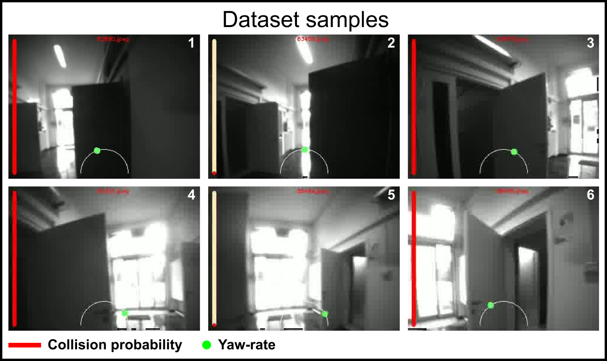

# Tiny-PULP-Dronet v3

The project's structure is the following:

```
.
└── drone-applications/
    ├── crazyflie-dronet-app/
    ├── external/
    |    └── crazyflie-firmware # tag 2022.01
    ├── gap8-dronet-app/ # use gap-sdk 3.9.1
    └── README.md
```

```
.
└── tiny-pulp-dronet-v3/
    ├── dataset/ # directory where you must put the PULP-Dronet v3 dataset
    │   ├── training/ # put here the training dataset, dowloaded from Zenodo
    │   └── testing/  # put here the testing dataset, dowloaded from Zenodo
    ├── drone-applications/ # code running on the Bitcraze Crazyflie 2.1 nano-drone and the GAP8 SoC
    │   ├── crazyflie-dronet-app/ # Crazyflie STM32 code (flight controller)
    │   │   ├── inc/ ...
    │   │   ├── src/ ...
    │   │   └── Makefile
    |   ├── external/
    |   |    └── crazyflie-firmware # use tag 2022.01
    │   └── gap8-dronet-app/ # AI-Deck GAP8 code (CNN processing + camera). Use gap-sdk 3.9.1
    │       ├── pulp-dronet-v3/ # main running pulp-dronet v3 (19fps, 320kB)
    │       │   ├── DORY_network/
    │       │   │   ├── inc/ ...
    │       │   │   └── src/ ...
    │       │   └── Makefile
    │       └── tiny-pulp-dronet-v3/ # main running tiny-pulp-dronet v3 (139fps, 2.9kB)
    │           ├── DORY_network/
    │           │   ├── inc/ ...
    │           │   └── src/ ...
    │           └── Makefile
    ├── imgs/ # images for readme
    ├── model/
    │   ├── dronet_v3.py # pytorch definition of the PULP-Dronet v3 CNN.
    │   ├── pulp-dronet-v3-resblock-1.0.pth # pre-trained pytorch model of PULP-Dronet v3
    │   └── tiny-pulp-dronet-v3-dw-pw-0.125.pth # pre-trained pytorch model of Tiny-PULP-Dronet v3
    ├── nemo-dory/
    │   ├── nemo/ # external: NEMO tool for quantization of CNNs
    │   └── dory_dronet/  # external: DORY tool for deployment of CNNs on MCUs
    ├── training/ # directory where all training checkpoints, logs, and tensorboard files are saved.
    ├── classes.py # class definitions used in the project.
    ├── conda_deps.yml # conda environment file.
    ├── config.py # default args for .py files.
    ├── README.md
    ├── testing.py # Test a pre-trained model on the testing set in pytorch
    ├── training.py # training and validation of a PULP-Dronet v3 CNN.
    └── utility.py # utility for python scripts: dataset loader, loss functions, checkpoint loading
```

# Requirements

### Clone

Clone recursively to get all submodules

```bash
git clone --recurive git@github.com:pulp-platform/pulp-dronet.git
```

### Python dependences

Install all the python dependences (for CNN training and testing):

```bash
conda env create -f conda_deps.yml
```

### Install NEMO (quantization tool)

Nemo is already added as a submodule inside `tiny-pulp-dronet-v3/nemo-dory/nemo/` folder.
If the recursive clone fails for anyu reason, download it from here: [github.com/pulp-platform/nemo](https://github.com/pulp-platform/nemo).

### Clone DORY (deployment tool)

Nemo is already added as a submodule inside `tiny-pulp-dronet-v3/nemo-dory/dory_dronet/` folder.
If the recursive clone fails for anyu reason, download it from here: [github.com/LorenzoLamberti94/dory_dronet](https://github.com/LorenzoLamberti94/dory_dronet).

### Install the GAP sdk

We use **version 3.9.1**
The most complete guide for installing the GAP-sdk can be found on the Greenwaves website: [greenwaves-technologies.com/setting-up-sdk/](https://greenwaves-technologies.com/setting-up-sdk/)

We provide some basic instructions at the end of the README. [Go to gap-sdk setup](#how-to-install-the-gap-sdk)

# The PULP-Dronet v3 dataset


<h2 align="center" style="margin-top: 20px; margin-bottom: 20px;">
  <a href="https://zenodo.org/records/13348430">
    Download
  </a>
</h2>

<p align="center" style="width: 70%; margin: 20px auto;">
  <i> We release the dataset as open source under Creative Commons Attribution-NonCommercial-ShareAlike 4.0 International License.
  See License.CC.md inside the downloaded zip file. </i>
</p>


<p align="center">
  
</p>


We collected a dataset of 77k images for nano-drones' autonomous navigation, for a total of 600MB of data.
We used the Bitcraze Crazyflie 2.1, collecting images from the AI-Deck's Himax HM01B0 monocrome camera.

The images in the PULP-Dronet v3 dataset have the following characteristics:
- **Resolution**: each image has a QVGA resolution of 324x244 pixels.
- **Color**: all images are grayscale, so they have 1 single channel.
- **Format**: the images are stored in `.jpeg` format.

A human pilot manually flew the drone, collecting *i*) images from the grayscale QVGA Himax camera sensor of the AI-deck, *ii*) the gamepad's yaw-rate, normalized in the [-1;+1] range, inputted from the human pilot, *iii*) the drone's estimated state,  and *iv*) the distance between obstacles and the drone measured by the front-looking ToF sensor.

After the data collection, we labeled all the images with a binary collision label whenever an obstacle was in the line of sight and closer than 2m.
We recorded 301 sequences in 20 different environments.
Each sequence of data is labeled with high-level characteristics, listed in `characteristics.json`:

For training our CNNs, we augmented the training images by applying random cropping, flipping, brightness augmentation, vignetting, and blur.
The resulting dataset has 157k images, split as follows: 110k, 7k, 15k images for training, validation, and testing, respectively.

To address the labels' bias towards the center of the [-1;+1] yaw-rate range in our testing dataset, we balanced the dataset by selectively removing a portion of images that had a yaw-rate of 0.
Specifically, we removed (only from the test set) some images having `yaw_rate==0` and `collision==1`.


| Dataset                 |   Train Images    | Validation Images |    Test Images    |    Total    |
|-------------------------|:-----------------:|:-----------------:|:-----------------:|:-----------:|
| PULP-Dronet v3          |      53,830       |      7,798        |      15,790       |   77,418    |
| PULP-Dronet v3 testing  |      53,830       |    **7,798**      |     **3,071**     |   64,699    |
| PULP-Dronet v3 training |   **110,138**     |     15,812        |      31,744       |  157,694    |


we use the `PULP-Dronet v3 training` for training and the  `PULP-Dronet v3 testing` for validation/testing, this is the final split:

| Dataset |   Train Images    | Validation Images |    Test Images    |    Total    |
|:-------:|:-----------------:|:-----------------:|:-----------------:|:-----------:|
| Final   |      110,138      |      7,798        |      3,071        |   121,007   |


**Notes:**

- **PULP-Dronet v3** and **PULP-Dronet v3 testing** datasets: Images are in full QVGA resolution (324x244px), uncropped.
- **PULP-Dronet v3 training** dataset: Images are cropped to `200x200px`, matching the PULP-Dronet input resolution. Cropping was done randomly on the full-resolution images to create variations.


### **Dataset Structure**

```
.
└── Dataset_PULP_Dronet_v3_*/
    ├── ETH finetuning/
    │       ├── acquisition1/
    │       │   ├── characteristics.json # metadata
    │       │   ├── images/ # images folder
    │       │   ├── labels_partitioned.csv # Labels for PULP-Dronet
    │       │   └── state_labels_DroneState.csv # raw data from the crazyflie
    |       ...
    │       └── acquisition39/
    ├── Lorenzo Bellone/
    │       ├── acquisition1/
    |       ...
    │       └── acquisition19/
    ├── Lorenzo Lamberti/
    │   ├── dataset-session1/
    |   │   ├── acquisition1/
    |   |   ...
    |   │   └── acquisition29/
    │   ├── dataset-session2/
    |   │   ├── acquisition1/
    |   |   ...
    |   │   └── acquisition55/
    │   ├── dataset-session3/
    |   │   ├── acquisition1/
    |   |   ...
    |   │   └── acquisition65/
    │   └── dataset-session4/
    |       ├── acquisition1/
    |       ...
    |       └── acquisition51/
    ├── Michal Barcis/
    │       ├── acquisition1/
    |       ...
    │       └── acquisition18/
    └── TII finetuning/
        ├── dataset-session1/
        │       ├── acquisition1/
        |       ...
        │       └── acquisition18/
        └── dataset-session2/
                ├── acquisition1/
                ...
                └── acquisition39/
```

This structure applies for all the three sets mentioned above: `PULP_Dronet_v3`, `PULP_Dronet_v3_training`, `PULP_Dronet_v3_testing`.

use the datasets as follows:

### **Dataset Labels**

**1.** **`labels_partitioned.csv`**
The  file contains metadata for the PULP-Dronet v3 image dataset.
The file includes the following columns:

- **filename**: The name of the image file (e.g., `25153.jpeg`).
- **label_yaw_rate**: The yaw rate label, representing the rotational velocity. values are in the [-1, +1] range, where `YawRate > 0` means counter-clockwise turn --> turn left, and `YawRate < 0` means clockwise turn --> turn right.
- **label_collision**: The collision label, in range [0,1]. `0` denotes no collision and `1` indicates a collision.
- **partition**: The dataset partition, i.e., `train`, `test`, or `valid`.

**2.** **`characteristics.json`**
contains metadata. This might be useful the user to filter the dataset on some specific characteristics, or to partition the images types equally:
**&#x23F5;** scenario (i.e., indoor or outdoor);
**&#x23F5;** path type (i.e., presence or absence of turns);
**&#x23F5;** obstacle types (e.g., pedestrians, chairs);
**&#x23F5;** flight height (i.e., 0.5, 1.0, 1.5 m/s);
**&#x23F5;** behaviour in presence of obstacles (i.e., overpassing, stand still, n/a);
**&#x23F5;** light conditions (dark, normal, bright, mixed);
**&#x23F5;** a location name identifier;
**&#x23F5;** acquisition date.


**3.** **`labeled_images.csv`**
the same as `labels_partitioned.csv`, but without the `partition` column. You can use this file to repeat the partition into train, valid, and test sets.

**4.** **`state_labels_DroneState.csv`**
This is the raw data logged from the crazyflie at ~100 samples/s.
The file includes the following columns:

- **timeTicks**: The timestamp.
- **range.front**: The distance measurement from the front VL53L1x ToF sensor [mm].
- **mRange.rangeStatusFront**: The status code of the front range sensor (check the VL53L1x datasheet for more info)
- **controller.yawRate**: The yaw rate command given by the human pilot (in radians per second).
- **ctrltarget.yaw**: The target yaw rate set by the control system (in radians per second).
- **stateEstimateZ.rateYaw**: The estimated yaw rate from the drone's state estimator (in radians per second).

**Data Processing Workflow**

- **`dataset_processing.py`**:
  - **Input**: `state_labels_DroneState.csv`
  - **Output**: `labeled_images.csv`
  - **Function**: matches the drone state labels (~100Hz) timestamp to the image's timestamp (~10Hz), discarding extra drone states.

- **`dataset_partitioning.py`**:
  - **Input**: `labeled_images.csv`
  - **Output**: `labels_partitioned.csv`
  - **Function**: Partitions the labeled images into training, validation, and test sets.


# How to: train and deploy PULP-Dronet v3

All the python scripts (training.py, testing.py, quantize.py) take default values of variables from the config.py file. Each argument added by command line will override default values.

## Training

```
# pulp-dronet v3
python training.py --gpu=0 --model_weights_path=pulp_dronet_v3    --block_type=ResBlock   --depth_mult=1.0    --bypass=True
# tiny-pulp-dronet-v3
python training.py --gpu=0 --model_weights_path=dw_pw_noby_0.125 --block_type=Depthwise  --depth_mult=0.125  --bypass=False
```

## Testing

You can test the pre-trained models on the testing set.
It will provide performances of both Accuracy (collision) and RMSE (yaw rate).

```bash
# pulp dronet v3
python testing.py --gpu=0 --model_weights_path=./model/pulp-dronet-v3-resblock-1.0.pth      --block_type=ResBlock  --depth_mult=1.0    --bypass=True  --data_path_testing=./dataset/
# tiny pulp dronet v3
python testing.py --gpu=0 --model_weights_path=./model/tiny-pulp-dronet-v3-dw-pw-0.125.pth  --block_type=Depthwise  --depth_mult=0.125 --bypass=False --data_path_testing=./dataset/
```

## Deployment flow: NEMO and DORY

How to run PULP-DroNet on GAP8 or GVSoC in three steps, starting from a pretrained model.

**1. NEMO (quantization):**

**&#x23F5; Input:** model definition (pytorch format, can be found in `model/dronet_v3.py`) + pre-trained weights (`.pth file`, can be found in `model/pulp-dronet-v3-resblock-1.0.pth` and `model/tiny-pulp-dronet-v3-dw-pw-0.125`)

**&#x23F5; Output:** ONNX graph model (`.onnx` file, including weights) + golden activations (`.txt` files, used by DORY for checksums)

**2. DORY (generation of optimized C code):**
- **Input**: ONNX graph model + golden activations (".txt" files)
* optimized C code for deployment on GAP8, generated in the "dory_examples/application/" folder

**3. GAP8 (run on platform):**
- **Input**: optimized C code generated by DORY (dory_examples/application/" folder)

### Detailed steps:

**1. Generate the onnx model with nemo script**

Here the scripts for quantizing Tiny-PULP-Dronet v3 and Tiny-PULP-Dronet v3:

```bash
conda activate pulp-dronet-v3

# pulp dronet v3
python quantize.py --gpu=0 --model_weights_path=../model/pulp-dronet-v3-resblock-1.0.pth        --block_type=ResBlock   --depth_mult=1.0   --bypass=True  --data_path_testing=./dataset/ --export_path=./nemo_output/
# tiny pulp dronet v3
python quantize.py --gpu=0 --model_weights_path=../model/tiny-pulp-dronet-v3-dw-pw-0.125.pth    --block_type=Depthwise  --depth_mult=0.125 --bypass=False --data_path_testing=./dataset/ --export_path=./nemo_output/
```

These commands will export both onnx models and weights to `./nemo_output/` folder.
I provide you the pre-quantized models at the following directories.

```bash
nemo-dory/nemo-output/
    ├── pulp-dronet-v3-resblock-1.0/
    └── tiny-pulp-dronet-v3-dw-pw-0.125/
```

**2. Use DORY to generate the C code**

DORY generates the deployment C code:

```bash
cd nemo-dory/dory_dronet/dory_example/
conda activate dory

# generate pulp-dronet v3
python network_generate.py --network_dir=../../nemo_output/pulp-dronet-v3-resblock-1.0/ --sdk=gap_sdk --Bn_Relu_Bits=64 --l2_buffer_size 410000  --l1_buffer_size 35000 --verbose_level=Check_all+Perf_final

# generate tiny-pulp-dronet v3
python network_generate.py --network_dir=../../nemo_output/tiny-pulp-dronet-v3-dw-pw-0.125/ --sdk=gap_sdk --Bn_Relu_Bits=64 --l2_buffer_size 410000  --l1_buffer_size 35000 --verbose_level=Check_all+Perf_final
```

The code gets generated under the `dory_dronet/dory_examples/application/` folder.
I provide you the already generated code at the following directories:

```
drone-applications/
    └── gap8_app/
        ├── pulp-dronet-v3/
        └── tiny-pulp-dronet-v3/
```


**3. Build and run on GAP8 (or GVSoC)**

_remember: open a new terminal, source your sdk and export the cfg for your debugger_

_remember: your gap sdk (or pulp sdk) must be correctly installed before you try to run on GAP8_ ([Go to GAP sdk setup](#how-to-install-the-gap-sdk))

```bash
source gap_sdk/configs/ai_deck.sh
export GAPY_OPENOCD_CABLE=$HOME/gap/gap_sdk/tools/gap8-openocd/tcl/interface/ftdi/olimex-arm-usb-ocd-h.cfg
```

then run PULP-DroNet on GAP8 **: )**

```bash
# RUN pulp-dronet v3 on the AI-Deck's GAP8
cd pulp-dronet/tiny-pulp-dronet-v3/drone-applications/gap8_app/pulp-dronet-v3/
make clean all run CORE=8 platform=board
# RUN tiny-pulp-dronet v3 on the AI-Deck's GAP8
cd pulp-dronet/tiny-pulp-dronet-v3/drone-applications/gap8_app/tiny-pulp-dronet-v3/
make clean all run CORE=8 platform=board
```

# Fly with PULP-Dronet


The `drone-applications/` folder contains the code for visual-based autonomous navigation that runs aboard the STM32 of the Crazyflie 2.1, and on the GAP8 SoC of the AI deck.
* the `crazyflie-dronet-application` is the flight controller, taking the CNN's outputs from the AI-Deck via UART
* the `gap8-dronet-app` is the code that acquires a new image, and makes the CNN forward inference, and ultimately passes the outputs to the STM32 via UART.

```
.
└── drone-applications/
    ├── crazyflie-dronet-app/
    ├── external/
    |    └── crazyflie-firmware # tag 2022.01
    ├── gap8-dronet-app/ # use gap-sdk 3.9.1
    └── README.md
```

### Requirements

* The gap-sdk installed (_tag: 3.9.1_). ([Instructions](../README.md##how-to-install-the-gap-sdk))
* download crazyflie-firmware (_tag: 2022.01_) into `./drone-applications/external/crazyflie-firmware/`
* Install the Crazyflie Client: [https://github.com/bitcraze/crazyflie-clients-python](https://github.com/bitcraze/crazyflie-clients-python). (_tag: 2022.01_)
* Install the crazyflie python libraries: [https://github.com/bitcraze/crazyflie-lib-python](https://github.com/bitcraze/crazyflie-lib-python) (_tag: 0.1.17.1_)

**Warning:** there is no compatibility with the new versions, as the crazyflie firmware changed drastically.


### 1. Flash the Crazyflie Application

Compile the code

```sh
cd ./drone-applications/crazyflie-dronet-app/
make clean platform=cf2
```

Now flash the application. While the drone is powered-off, hold the power-on button for 3 seconds. This should put the drone into bootloader mode. Then run:

```sh
make cload
```

Wait for the flashing to be completed.


### 2. Flash the GAP8 SoC

Power on the AI-deck and connect the JTAG cable.

Source the gap-sdk (make sure you installed it)

```bash
source gap_sdk/configs/ai_deck.sh
export GAPY_OPENOCD_CABLE=$HOME/gap/gap_sdk/tools/gap8-openocd/tcl/interface/ftdi/olimex-arm-usb-ocd-h.cfg
```

Flash the gap8 application.

```sh
cd ./drone-applications/gap-dronet-app/
make clean all
make flash
```

Now power cycle the drone (turn of and on). Pulp-Dronet is running in the AI-deck!


### 3. Running Pulp-Dronet

Mount the AI-deck on the top of the Crazyflie.
Launch the Crazyflie Client:

```sh
cfclient
```

To fly the drone, go to the `Parameters` tab of the cfclient and set the `fly` parameter from the `START_STOP` group to 1.
The drone will take off and start the autonomous navigation.

Note: if you enable debug printfs, you can see them in the `Console` tab of the cfclient.


# How to install the gap-sdk

_Tested version of the sdk is: 3.9.1_

You must install the GAP sdk (or the [PULP sdk](https://github.com/pulp-platform/pulp-sdk)) to use GVSoC or to run code on GAP8 SoC.
Here you can find the basic steps to install the GAP sdk. Full GWT guide can be found at: https://greenwaves-technologies.com/setting-up-sdk/


## Prerequisites

#### OS and gcc version

```
Ubuntu 20.04.6 LTS
gcc version 9.4.0 (Ubuntu 9.4.0-1ubuntu1~20.04.2)
```

#### Conda

*Python version: 3.6.10*

Create a conda environment (and call it gap_sdk) to install all the packets needed by the sdk (pip commands below).

```bash
conda create --name gap_sdk python==3.6.10 numpy cython
conda activate gap_sdk
```

#### packages for the sdk

```
sudo apt-get install -y build-essential git libftdi-dev libftdi1 doxygen python3-pip libsdl2-dev curl cmake libusb-1.0-0-dev scons gtkwave libsndfile1-dev rsync autoconf automake texinfo libtool pkg-config libsdl2-ttf-dev
```

#### Opencv3.2

Unfortunately it is not ufficially supported anymore. But here's how to install it

This is a repo that allows to do so: [gist.github.com/syneart/3e6bb68de8b6390d2eb18bff67767dcb](https://gist.github.com/syneart/3e6bb68de8b6390d2eb18bff67767dcb)
To install execute the following

```bash
wget -O - https://gist.githubusercontent.com/syneart/3e6bb68de8b6390d2eb18bff67767dcb/raw/OpenCV3.2withContrib.sh | bash
```

check if installed correctly:
```bash
 dpkg -l | grep libopencv
```

## Clone sdk and extra tools

The final  repository has to look like

```
/home/YOUR_USER/gap/
    ├── gap_gnu_toolchain
    ├── gap8_openocd
    └── gap-sdk/
```

#### Install Toolchain

```bash
git clone https://github.com/GreenWaves-Technologies/gap_gnu_toolchain
cd gap_gnu_toolchain
git checkout 6fc27059038575e3bfef2b36ad7963a3ea77863e
./install.sh
# if you chose a custom path for install, add this to your .bashrc file:
export GAP_RISCV_GCC_TOOLCHAIN="custom/path/that/you/chose"
```

#### Install OpenOCD

*commit SHA: 6fc27059038575e3bfef2b36ad7963a3ea77863e*

Clone, build and install OpenOCD for GAP8:

```bash
git clone https://github.com/GreenWaves-Technologies/gap8_openocd.git
cd gap8_openocd
git checkout 6fc27059038575e3bfef2b36ad7963a3ea77863e
./bootstrap
./configure --program-prefix=gap8- --prefix=/usr --datarootdir=/usr/share/gap8-openocd
make -j
sudo make -j install

#Finally, copy openocd udev rules and reload udev rules
sudo cp /usr/share/gap8-openocd/openocd/contrib/60-openocd.rules /etc/udev/rules.d
sudo udevadm control --reload-rules && sudo udevadm trigger
```

Now, add your user to dialout group.

```bash
sudo usermod -a -G dialout <username> # This will require a logout / login to take effect
```

Finally, logout of your session and log back in.


#### Build gap-sdk

*gap-sdk version: 3.9.1 (bbdec24018212447cb9ece8ca615b969994a0a37)*

```bash
# clone anche checkout
git clone https://github.com/GreenWaves-Technologies/gap_sdk.git
cd gap_sdk
git checkout release-v3.9.1
git submodule update --init --recursive

# source the right board
source configs/ai-ai_deck.sh

# install dependencies
conda activate gap_sdk
pip install -r requirements.txt
pip install -r tools/nntool/requirements.txt

# build the sdk!
make sdk
```

IMPORTANT: always run the sourceme.sh in a fresh new terminal.


#### Check everything works

**Test on GVSoC (system-on-chip simulator)**

```bash
cd gap_sdk/examples/pmsis/helloworld
make clean all run platform=gvsoc
```

**Test on the board**

```bash
export GAPY_OPENOCD_CABLE=interface/ftdi/olimex-arm-usb-ocd-h.cfg
export GAP_RISCV_GCC_TOOLCHAIN="/home/YOUR_USER_PATH/gap/gap_gnu_toolchain"

cd gap_sdk/examples/pmsis/helloworld/
make clean all run platform=board
```

There are different cables setup by default for each board ([here the list of defices supported](https://github.com/GreenWaves-Technologies/gap_sdk/tree/master/tools/gap8-openocd/tcl/interface/ftdi)). In case you want to use a different cable, you can define this environment variable:

```
GAPY_OPENOCD_CABLE=$HOME/gap_sdk/tools/gap8-openocd/tcl/interface/ftdi/olimex-arm-usb-ocd-h.cfg
```